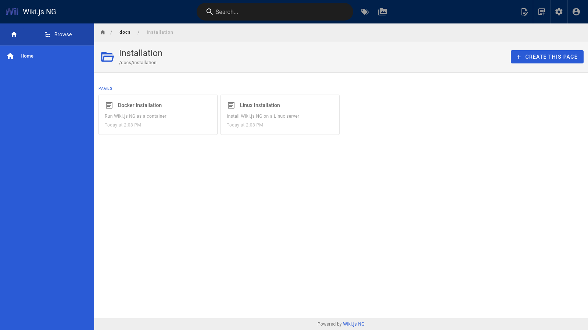
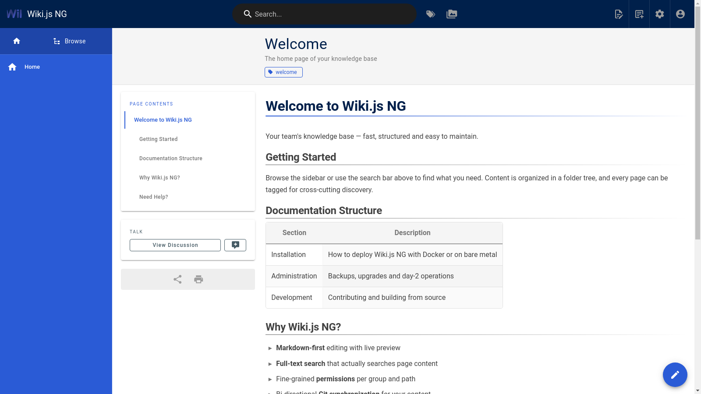
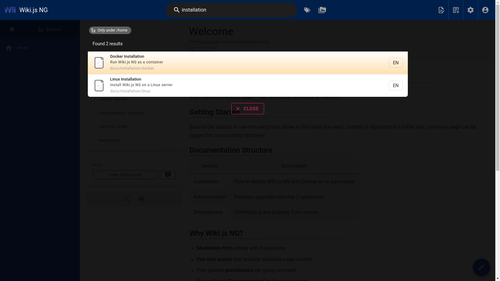
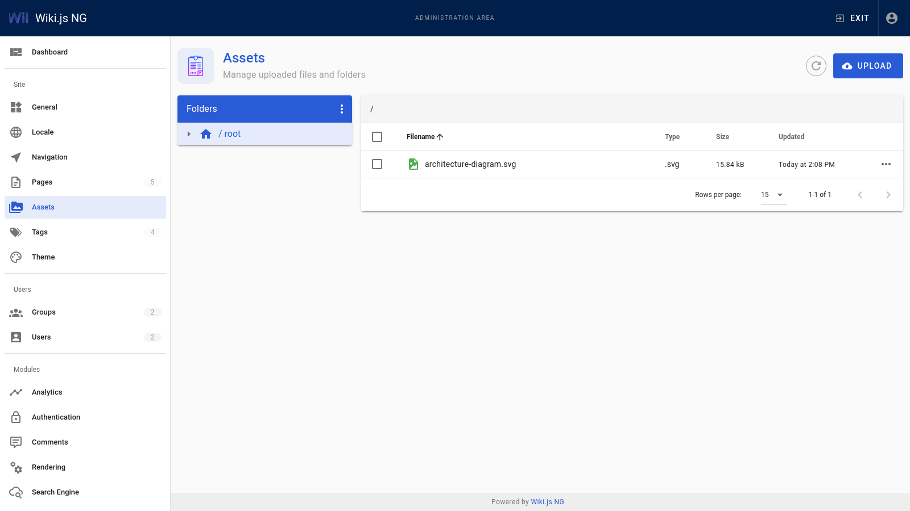
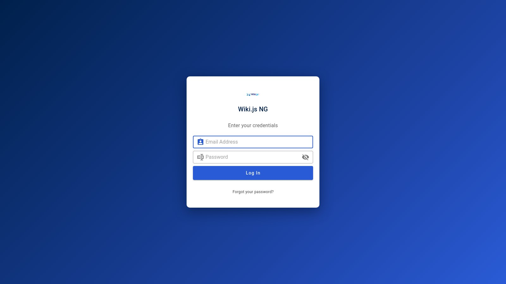

# Wiki.js NG

[](https://github.com/swissmakers/wikijs-ng/releases)
[](https://github.com/swissmakers/wikijs-ng/blob/main/LICENSE)
[](https://hub.docker.com/r/swissmakers/wikijs-ng)
[](https://github.com/sponsors/swissmakers)
[](http://standardjs.com/)

**Wiki.js NG** is a hardened, actively maintained fork of Wiki.js 2.x — the modern, lightweight and powerful wiki engine built on Node.js.

Wiki.js NG is maintained by [Swissmakers GmbH](https://swissmakers.ch) and focuses on long-term operability: a current runtime and dependency baseline, closed security findings and reliability fixes for enterprise deployments — while remaining fully compatible with existing Wiki.js installations and content.

## Overview

Wiki.js NG provides a complete, self-hosted knowledge management platform:

- Markdown, visual (WYSIWYG), code, and AsciiDoc editors
- Full-text search (built-in database search, Elasticsearch, and more)
- Fine-grained access control with groups and page rules
- Authentication via local accounts, LDAP, SAML 2.0, OpenID Connect, OAuth2 and numerous social providers
- Bi-directional Git synchronization and additional storage backends (S3-compatible, Azure Blob, local disk, and more)
- Runs on PostgreSQL (recommended), MySQL, MariaDB, SQLite or MS SQL Server

For end-user and administration documentation, the upstream [Wiki.js 2.x documentation](https://docs.requarks.io/) remains applicable.

## What is different in Wiki.js NG

| Area | Change |
| --- | --- |
| Runtime | Node.js 24 baseline (enforced at setup, install and image level) |
| Dependency baseline | Fully modernized stack -> Webpack 5, Vue 2.7 / Vuetify 2.7, Apollo Server 5 + GraphQL 16, graphql-ws subscriptions, Knex 3 / Objection 3, AWS SDK v3, current passport / @node-saml |
| Security | Removed EOL and vulnerable packages (`request`, `aws-sdk` v2, `subscriptions-transport-ws`, `raven`, multer 1.x, forced legacy `xml-crypto`, and lot more..) |
| Git storage | Hardened bi-directional sync with self-healing worktree recovery, deterministic conflict resolution |
| Stability | Bounded background worker processes, scheduler fixes, resource-aware build tooling |
| Delivery | Reproducible multi-arch container images (amd64 / arm64) with OCI metadata, published to Docker Hub and GHCR |

See the [CHANGELOG](CHANGELOG.md) for the complete list of changes since the fork.

## A quick look

**Browsable folder views** -> navigating to a path without a page of its own no longer dead-ends. You also get a proper folder page listing all subfolders and child pages.



**Refreshed page design** -> tags in the page header, table of contents with active-section highlighting, and an author footer under the content.



**Full-text search with scoping** -> MariaDB/MySQL search engine indexes actual page content with relevance ranking, and results can be restricted to the current locale or path subtree.



**Asset management** -> full admin file manager with folder rename/move/delete, bulk operations and drag & drop, backed by proper storage-sync events (Git sees moves as moves).



**Enterprise-style login** -> clean credentials card on the brand gradient, with all configured authentication strategies.



## Getting started

### Prebuilt container images (recommended)

Images are published for `linux/amd64` and `linux/arm64`:

| Registry | Image |
| --- | --- |
| Docker Hub | [`swissmakers/wikijs-ng`](https://hub.docker.com/r/swissmakers/wikijs-ng) |
| GitHub Container Registry | [`ghcr.io/swissmakers/wikijs-ng`](https://github.com/swissmakers/wikijs-ng/pkgs/container/wikijs-ng) |

Available tags: `latest`, `v<version>` (for example `v2.6.0`), and the commit SHA for fully reproducible deployments.

Quick start with PostgreSQL (Podman and Docker are interchangeable):

```bash
podman run -d --name wikijs-ng -p 3000:3000 \
  -e DB_TYPE=postgres \
  -e DB_HOST=db.example.com \
  -e DB_PORT=5432 \
  -e DB_USER=wikijs \
  -e DB_PASS=changeme \
  -e DB_NAME=wiki \
  ghcr.io/swissmakers/wikijs-ng:latest
```

Evaluation setup with SQLite (single container, persistent volume):

```bash
podman run -d --name wikijs-ng -p 3000:3000 \
  -e DB_TYPE=sqlite -e DB_FILEPATH=/wiki/data/db.sqlite \
  -v wikijs-data:/wiki/data \
  ghcr.io/swissmakers/wikijs-ng:latest
```

Open `http://localhost:3000` and complete the setup wizard. A compose example including PostgreSQL is provided in [`dev/examples/docker-compose.yml`](dev/examples/docker-compose.yml).

### Requirements

- A supported database: PostgreSQL 11+ (recommended), MySQL 8+, MariaDB 10.3+, SQLite 3.9+ or MS SQL Server 2012+
- For container deployments: Podman 4+ or Docker
- For source installations: Node.js 24 or later

## Building from source

```bash
yarn install
yarn build          # production client assets
node server         # start Wiki.js NG
```

On memory-constrained hosts use the resource-capped build wrapper:

```bash
yarn build:safe
```

Building the container image locally, including multi-arch builds, is documented in [`dev/BUILD.md`](dev/BUILD.md). Continuous builds are performed by CI on every push to `main`.

## Upgrading from Wiki.js 2.5.314

Wiki.js NG is intended to be a direct replacement for Wiki.js. It uses the same database schema, configuration format and content storage. You can point the container at your existing database and data volumes. Review the [CHANGELOG](CHANGELOG.md) before upgrading, in particular the notes on the Git storage module and SAML configuration options.

## Running fully offline

Wiki.js NG does not depend on any upstream service. The interface translations
for English, German, French and Italian are bundled in `server/locales/`; there
is no download or sync of language packs anymore. Additional languages or
custom wording can be sideloaded as YAML files into `data/sideload/locales/`
(see [`server/locales/README.md`](server/locales/README.md)).

## Security

Please report vulnerabilities responsibly through a [private security advisory](https://github.com/swissmakers/wikijs-ng/security/advisories/new). Do not open public issues for security problems. See [SECURITY.md](SECURITY.md) for the supported versions and full reporting guidelines.

## Support and sponsoring

- Issues and feature requests: [GitHub issue tracker](https://github.com/swissmakers/wikijs-ng/issues)
- Commercial support and consulting: [swissmakers.ch](https://swissmakers.ch)
- If Wiki.js NG is valuable to your organization, please consider [sponsoring the project on GitHub](https://github.com/sponsors/swissmakers) to support ongoing maintenance and security work.

## License and acknowledgements

Wiki.js NG is licensed under the [AGPL-3.0](LICENSE), the same license as the upstream project.

This project is a fork of [Wiki.js](https://github.com/requarks/wiki) by Nicolas Giard and contributors. We are grateful for the years of work that went into the upstream project; upstream fixes are reviewed and merged where applicable.
